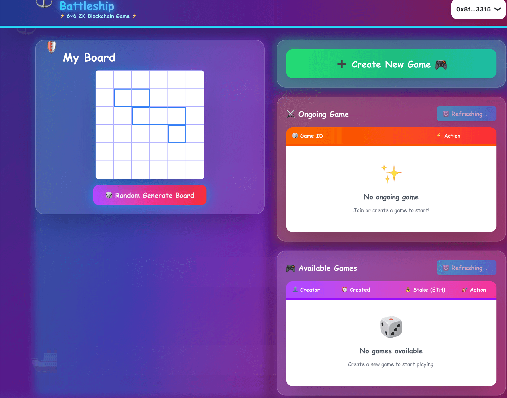
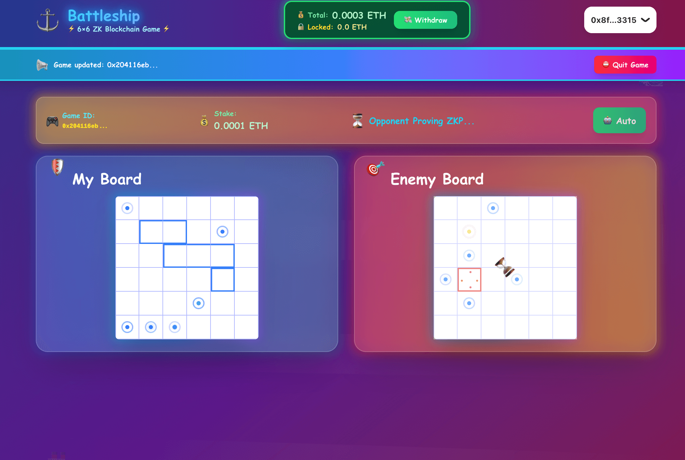
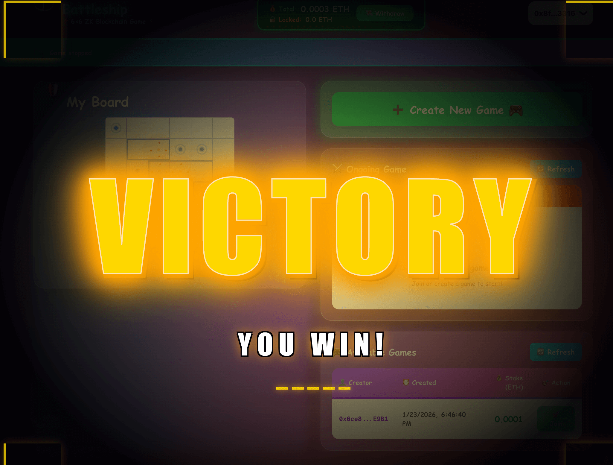

# ⚓ Battleship — ZK Blockchain Multiplayer

[](https://nextjs.org/)
[](https://www.typescriptlang.org/)
[](https://tailwindcss.com/)
[](https://wagmi.sh/)

A modern, fully on-chain Battleship game with Zero-Knowledge proofs, featuring P2P multiplayer, ETH stakes, and a stunning playful UI. Built with Next.js and powered by advanced ZK circuits for provably fair gameplay.

## 🎯 What Makes This Special

- **🔐 Zero-Knowledge Proofs** — Ship positions remain hidden until revealed, powered by Noir circuits
- **⛓️ Fully On-Chain** — All game logic secured by smart contracts on Arbitrum
- **🎮 Dual Network Modes** — Choose between P2P (Trystero) or PartyKit for multiplayer
- **💎 Beautiful UI** — Playful, toy-like design with animations and glassmorphism effects
- **💰 Real Stakes** — Wager ETH with provably fair outcomes

## 📚 Credits & Attribution

This project builds upon the excellent ZK Battleship implementation:

### Smart Contract
The game contract is sourced from:
- **Repository:** [jayden-sudo/ZK-Battleship](https://github.com/jayden-sudo/ZK-Battleship)
- **Contract:** [`ZKBattleshipV2.sol`](https://github.com/jayden-sudo/ZK-Battleship/blob/main/contract/src/ZKBattleshipV2.sol)

### Zero-Knowledge Circuit
The ZK proof generation circuit is sourced from:
- **Repository:** [jayden-sudo/ZK-Battleship](https://github.com/jayden-sudo/ZK-Battleship)  
- **Circuit:** [`process_shot` (Noir)](https://github.com/jayden-sudo/ZK-Battleship/blob/main/circuit/bin/process_shot/src/main.nr)


---

## 🚀 Live Demo

**[Play Now](https://battleship-web-ten.vercel.app)** • [Learn the Rules](#-features) • [View Source](https://github.com/jayden-sudo/ZK-Battleship)

### ⚠️ Development Status

This game is currently in **active development**. Please be aware of the following limitations:

- **🔌 No Reconnection Support** — If either player disconnects during a game, the system will switch to a safe on-chain mode. You may need to manually resolve the game state through the blockchain.
  
- **🔄 No Error Recovery** — If you encounter an error during gameplay and refresh the page, you **will not be able to rejoin the ongoing game**. The game state will be lost locally, and you'll need to quit the game on-chain (with potential stake loss).

**Recommendation:** Ensure stable internet connection before starting a game with real stakes.

## 🌈 Game Preview

<div align="center">

### Lobby - Waiting for Players


*Create or join games, manage your balance, and randomize your board setup*

---

### In-Game - Battle in Progress


*Real-time gameplay with visual feedback, turn indicators, and strategic targeting*

---

### Game Over - Victory Screen


*Celebrate your wins with stunning animations and claim your rewards*

## �📋 Table of Contents

- [Live Demo](#-live-demo)
- [Development Status](#️-development-status)- [Game Preview](#-game-preview)- [Features](#-features)
- [Architecture](#-architecture)
- [Quick Start](#-quick-start)
- [Environment Setup](#-environment-setup)
- [Development](#-development)
- [API Documentation](#-api-documentation)
- [Troubleshooting](#-troubleshooting)
- [Contributing](#-contributing)

## ✨ Features

### 🎮 Core Gameplay

- **Classic 6×6 Grid** — Simplified battleship rules with modern twist
- **Zero-Knowledge Proofs** — Ship positions cryptographically hidden until hit
- **Smart Contract Logic** — All game rules enforced on-chain (Arbitrum)
- **ETH Wagering** — Stake real value on your strategic skills
- **Fair Randomness** — ZK circuits ensure provably fair outcomes

### 🌐 Network Modes

Choose your preferred multiplayer backend:

| Feature | P2P Mode (Trystero) | PartyKit Mode |
|---------|-------------------|---------------|
| **Connection** | Peer-to-peer via WebRTC | Centralized WebSocket |
| **Signaling** | Supabase | PartyKit server |
| **Lobby Status** | No online indicators | Real-time player counts |
| **NAT Traversal** | Requires TURN/STUN | Server-mediated |
| **Best For** | Privacy-focused | Quick matchmaking |

### 🎨 UI/UX Highlights

- **🌈 Playful Design** — Colorful gradients, animations, and toy-like aesthetics
- **💎 Glassmorphism** — Modern frosted glass effects throughout
- **🎯 Visual Feedback** — Crosshair targeting, explosion effects, water splashes
- **📱 Responsive** — Seamless experience on desktop, tablet, and mobile
- **🌓 Dark Theme** — Easy on the eyes with vibrant accents
- **⚡ Real-time Updates** — Turn indicators and game state sync

### 🔧 Technical Features

- **TypeScript Throughout** — Full type safety across the stack
- **P2P Config Caching** — 6-hour localStorage cache for optimal performance
- **Mock Development Mode** — Test P2P features offline
- **Dynamic ICE Servers** — Auto-configured TURN/STUN from Cloudflare
- **Wallet Abstraction** — EIP-6963 multi-wallet support via wagmi
- **Event-Driven Architecture** — Clean separation of game logic and UI

## 🏗 Architecture

```
┌──────────────────────────────────────────────────────────┐
│                   Frontend (Next.js)                     │
│  ┌────────────┐  ┌─────────────┐  ┌──────────────────┐   │
│  │ Game UI    │  │ Game Manager│  │ Board Components │   │
│  │ Components │◄─┤  (State)    │◄─┤   (Rendering)    │   │
│  └────────────┘  └─────────────┘  └──────────────────┘   │
└────────────┬─────────────────────────────────┬───────────┘
             │                                 │
             ▼                                 ▼
    ┌────────────────┐              ┌──────────────────┐
    │ Smart Contract │              │  Network Layer   │
    │  (Arbitrum)    │              │  (Choose Mode)   │
    │                │              ├──────────────────┤
    │ • ZKBattleship │              │ P2P (Trystero)   │
    │ • Stake Logic  │              │ • Supabase       │
    │ • ZK Verify    │              │ • TURN/STUN      │
    └────────────────┘              │ OR               │
                                    │ PartyKit         │
                                    │ • WebSocket      │
                                    │ • Lobby Server   │
                                    └──────────────────┘
```

### 🔑 Key Components

| Component | Purpose | Technology |
|-----------|---------|------------|
| **Game Manager** | Core game logic, state management, ZK proof generation | TypeScript |
| **Contract Interface** | Blockchain interactions, transaction handling | wagmi, ethers |
| **Trystero Manager** | P2P connection with config caching | Trystero, WebRTC |
| **PartyKit Server** | Real-time multiplayer lobby | PartyKit, WebSocket |
| **Board Components** | Interactive game grid with animations | React, Tailwind |
| **ZK Circuit** | Process shot validation | Noir (from source) |

### 🔐 Zero-Knowledge Flow

```
1. Player places ships → Generate commitment hash
2. Player shoots → Create ZK proof of valid hit/miss
3. Contract verifies proof → Update game state on-chain
4. Opponent cannot see ship positions until game ends
```

## 🚀 Quick Start

### Prerequisites

- Node.js 18+ and npm
- Wallet with Arbitrum Sepolia ETH
- Supabase project (for P2P signaling)
- Cloudflare account with TURN access

### Installation

```bash
# Install dependencies
npm install

# Copy environment template
cp .env.example .env.local
```

## 🔧 Environment Setup

Create `.env.local` in your project root:

```bash
# ════════════════════════════════════════════════════════
#  Network Configuration (Choose One Mode)
# ════════════════════════════════════════════════════════

# ┌─────────────────────────────────────────────────────┐
# │  Option 1: P2P Mode (Privacy-Focused)               │
# └─────────────────────────────────────────────────────┘
NEXT_PUBLIC_USE_P2P=true
NEXT_PUBLIC_USE_PARTYKIT=false

# Supabase (Required for P2P signaling)
SUPABASE_URL=https://your-project.supabase.co
SUPABASE_ANON_KEY=eyJhbGciOiJIUzI1NiIsInR5cCI6IkpXVCJ9...

# Cloudflare TURN (Optional but recommended for NAT traversal)
CLOUDFLARE_TURN_ID=your-turn-key-id
CLOUDFLARE_TURN_API=your-turn-api-token

# ┌─────────────────────────────────────────────────────┐
# │  Option 2: PartyKit Mode (Quick Matchmaking)        │
# └─────────────────────────────────────────────────────┘
NEXT_PUBLIC_USE_P2P=false
NEXT_PUBLIC_USE_PARTYKIT=true
NEXT_PUBLIC_PARTYKIT_HOST="localhost:1999"    # Local development
# NEXT_PUBLIC_PARTYKIT_HOST="xxx.xxx.partykit.dev"  # Production

# ┌─────────────────────────────────────────────────────┐
# │  Development/Testing Options                        │
# └─────────────────────────────────────────────────────┘
# Mock P2P (No external dependencies needed)
NEXT_PUBLIC_USE_MOCK_P2P=false  # Set to 'true' for offline testing
```

### 📝 Getting Your Credentials

<b>🔹 Supabase Setup</b> (Required for P2P Mode)

1. Create a free [Supabase project](https://supabase.com/dashboard)
2. Navigate to **Settings** → **API**
3. Copy your **Project URL** and **anon/public key**
4. Paste into `.env.local`

> **Note:** No database setup needed! Supabase is only used for WebRTC signaling.

 

<b>🔹 Cloudflare TURN Setup</b> (Optional - Improves P2P connectivity)

1. Go to [Cloudflare Calls Dashboard](https://dash.cloudflare.com/calls)
2. Create a new **TURN key**
3. Copy the **Key ID** and **API Token**
4. Add to `.env.local`

> **Why?** Helps P2P connections work behind strict firewalls/NATs.

<b>🔹 PartyKit Setup</b> (Alternative to P2P)

**For Local Development:**
```bash
npx partykit dev  # Starts on localhost:1999
```

**For Production:**
```bash
npx partykit deploy
# Use the provided URL (e.g., xxx.partykit.dev) as NEXT_PUBLIC_PARTYKIT_HOST
```

> **Benefits:** Real-time lobby, online status indicators, no NAT issues.


## 🛠 Development

### Start Development Server

```bash
# Install dependencies first
npm install

# Start the application
npm run dev
```

Visit [http://localhost:3000/login](http://localhost:3000/login)

### 📋 Available Scripts

| Command | Description |
|---------|-------------|
| `npm run dev` | Start development server with hot reload |
| `npm run build` | Build optimized production bundle |
| `npm run start` | Start production server (requires build) |
| `npm run type-check` | Run TypeScript type checking |
| `npm run lint` | Run ESLint code quality checks |

**PartyKit Commands** (if using PartyKit mode):
| Command | Description |
|---------|-------------|
| `npx partykit dev` | Start PartyKit server (localhost:1999) |
| `npx partykit deploy` | Deploy PartyKit server to production |

### 🎮 Development Workflows


<b>🟢 PartyKit Mode</b> (Recommended for beginners)

```bash
# Terminal 1: Start PartyKit server
npx partykit dev

# Terminal 2: Start Next.js app
npm run dev

# Configuration in .env.local:
NEXT_PUBLIC_USE_PARTYKIT=true
NEXT_PUBLIC_USE_P2P=false
NEXT_PUBLIC_PARTYKIT_HOST="localhost:1999"
```

**Pros:** Easy setup, no external dependencies, real-time lobby.


<b>🔵 P2P Mode</b> (For production privacy)

```bash
# Single terminal
npm run dev

# Configuration in .env.local:
NEXT_PUBLIC_USE_P2P=true
NEXT_PUBLIC_USE_PARTYKIT=false
SUPABASE_URL=https://your-project.supabase.co
SUPABASE_ANON_KEY=eyJhbGci...
CLOUDFLARE_TURN_ID=your-turn-key  # Optional
CLOUDFLARE_TURN_API=your-api-token  # Optional
```

**Pros:** Decentralized, privacy-focused, no central server needed.


<b>🟡 Mock P2P Mode</b> (Offline testing)

```bash
# Start with mock P2P enabled
npm run dev

# Configuration in .env.local:
NEXT_PUBLIC_USE_MOCK_P2P=true
NEXT_PUBLIC_USE_P2P=true
NEXT_PUBLIC_USE_PARTYKIT=false
```

**Pros:** No internet required, test P2P logic locally, fast iteration.


## 📡 API Documentation

### `GET /api/p2p-config`

Returns dynamic P2P configuration with ICE servers for WebRTC connections.

#### Response Schema

```typescript
{
  appId: string;           // Supabase project URL
  supabaseKey: string;     // Supabase anon key
  rtcConfig: {
    iceServers: [
      {
        urls: string[];    // STUN server URLs
      },
      {
        urls: string[];    // TURN server URLs (if configured)
        username: string;  // TURN credentials
        credential: string;
      }
    ]
  }
}
```

#### Example Response

```json
{
  "appId": "https://your-project.supabase.co",
  "supabaseKey": "eyJhbGciOiJIUzI1NiIs...",
  "rtcConfig": {
    "iceServers": [
      {
        "urls": ["stun:stun.cloudflare.com:3478"]
      },
      {
        "urls": [
          "turn:turn.cloudflare.com:3478?transport=udp",
          "turns:turn.cloudflare.com:443?transport=tcp"
        ],
        "username": "g0068953dd027db83...",
        "credential": "63d13d8895782f4e..."
      }
    ]
  }
}
```

#### Caching Strategy

- **Client-Side Cache:** 6 hours in `localStorage`
- **Fallback Behavior:** Uses STUN-only if TURN credentials fail
- **Offline Mode:** Serves expired cache if API unavailable

#### Testing the API

```bash
# Pretty-print the response
curl http://localhost:3000/api/p2p-config | jq

# Check cache headers
curl -I http://localhost:3000/api/p2p-config
```

## 🔧 Troubleshooting

### Common Issues & Solutions


<b>❓ "Server configuration error" in API</b>

**Problem:** Missing environment variables

**Solution:**
```bash
# Verify variables are set
echo $SUPABASE_URL
echo $SUPABASE_ANON_KEY

# If missing, add to .env.local:
SUPABASE_URL=https://your-project.supabase.co
SUPABASE_ANON_KEY=eyJhbGci...
```

**Prevention:** Copy `.env.example` to `.env.local` before starting.


<b>❓ P2P connection fails or times out</b>

**Problem:** Network restrictions, missing TURN servers, or NAT issues

**Solutions (Try in order):**

1. **Enable Cloudflare TURN credentials:**
   ```bash
   # Add to .env.local
   CLOUDFLARE_TURN_ID=your-turn-key-id
   CLOUDFLARE_TURN_API=your-turn-api-token
   ```

2. **Check firewall settings:**
   - Allow UDP ports 3478, 19302
   - Allow TCP port 443

3. **Switch to PartyKit mode:**
   ```bash
   NEXT_PUBLIC_USE_PARTYKIT=true
   NEXT_PUBLIC_USE_P2P=false
   ```

4. **Try mock P2P mode for local testing:**
   ```bash
   NEXT_PUBLIC_USE_MOCK_P2P=true
   ```


<b>❓ PartyKit connection fails</b>

**Problem:** PartyKit server not running or wrong host configuration

**Solutions:**

1. **Start PartyKit server:**
   ```bash
   npx partykit dev
   # Should output: Listening on localhost:1999
   ```

2. **Verify host in `.env.local`:**
   ```bash
   # Local development
   NEXT_PUBLIC_PARTYKIT_HOST="localhost:1999"
   
   # Production
   NEXT_PUBLIC_PARTYKIT_HOST="xxx.partykit.dev"
   ```

3. **Check port availability:**
   ```bash
   # macOS/Linux
   lsof -i :1999
   
   # Windows
   netstat -ano | findstr :1999
   ```

4. **Deploy to production:**
   ```bash
   npx partykit deploy
   # Use the provided URL in .env.local
   ```


<b>❓ Wallet connection issues</b>

**Problem:** Wrong network or wallet not configured

**Solution:**

1. **Switch to Arbitrum Sepolia:**
   - Open your wallet
   - Click network dropdown
   - Select "Arbitrum Sepolia"

2. **Add network manually (if not listed):**
   - **Network Name:** Arbitrum Sepolia
   - **RPC URL:** `https://sepolia-rollup.arbitrum.io/rpc`
   - **Chain ID:** `421614`
   - **Currency Symbol:** `ETH`
   - **Block Explorer:** `https://sepolia.arbiscan.io`

3. **Get testnet ETH:**
   - Visit [Arbitrum Sepolia Faucet](https://faucet.quicknode.com/arbitrum/sepolia)
   - Request ETH for your wallet address


<b>❓ Build or type errors</b>

**Problem:** Dependency issues or TypeScript errors

**Solutions:**

1. **Clean install:**
   ```bash
   rm -rf node_modules package-lock.json
   npm install
   ```

2. **Check TypeScript:**
   ```bash
   npm run type-check
   ```

3. **Verify Node.js version:**
   ```bash
   node --version  # Should be 18.x or higher
   ```

4. **Clear Next.js cache:**
   ```bash
   rm -rf .next
   npm run dev
   ```


### 📞 Still Having Issues?

- Check the [GitHub Issues](https://github.com/your-repo/issues)
- Review browser console for detailed error messages
- Ensure all environment variables are correctly set
- Try switching between P2P and PartyKit modes

## 🤝 Contributing

We welcome contributions! Here's how you can help:

### Ways to Contribute

- 🐛 **Report Bugs** — Open an issue with reproduction steps
- 💡 **Suggest Features** — Share your ideas for improvements
- 📝 **Improve Docs** — Fix typos, add examples, clarify instructions
- 🎨 **Enhance UI** — Submit design improvements or animations
- 🔧 **Fix Issues** — Pick up existing issues and submit PRs

### Development Workflow

1. **Fork the repository**
2. **Create a feature branch:** `git checkout -b feature/amazing-feature`
3. **Make your changes** and test thoroughly
4. **Commit with clear messages:** `git commit -m 'Add amazing feature'`
5. **Push to your fork:** `git push origin feature/amazing-feature`
6. **Open a Pull Request** with description of changes

### Code Guidelines

- Follow existing code style (TypeScript, ESLint)
- Add comments for complex logic
- Test your changes in both P2P and PartyKit modes
- Update documentation if adding features

---

## 🙏 Acknowledgments

- **[@jayden-sudo](https://github.com/jayden-sudo)** for the original [ZK-Battleship](https://github.com/jayden-sudo/ZK-Battleship) smart contract and ZK circuit
- **[Noir](https://noir-lang.org/)** team for the amazing ZK DSL
- **[wagmi](https://wagmi.sh/)** for wallet integration abstractions
- **[PartyKit](https://partykit.io/)** for real-time multiplayer infrastructure
- All contributors who help improve this project

## 📄 License

See the [LICENSE](LICENSE) file for details.
